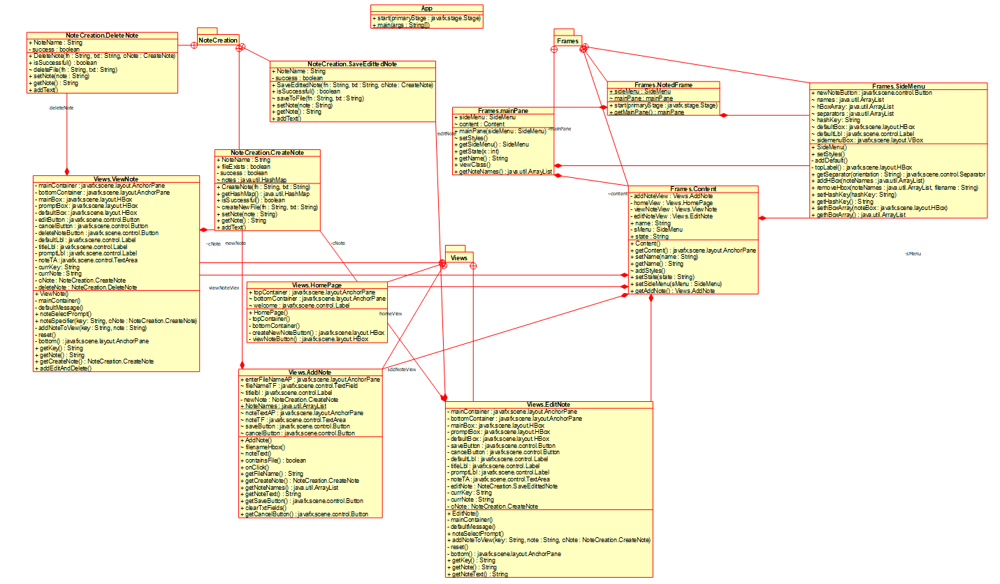

# Noted App
**Notable Design Choices:**
- Modal Design - implementation of states and views  

**Known Bugs:**
- Scrollbar shows in AddNote View when it is unnecessary.
- When creating a note with a duplicate file name, an alert is displayed erasing the note that was just typed.

Click [here](https://docs.google.com/document/d/18Gy4IWechdzUz52p8wScHnLzDVwGvMkYwSEqjeBZVLA/edit?usp=sharing) to view our User Guide!

**UML diagram**

